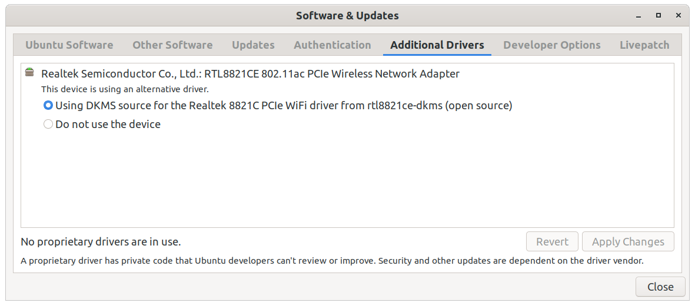

# Ubuntu

## Edit Sources.list

```bash
sudo vim /etc/apt/sources.list
```

## Local Network Share


Insert your mobile hard drive, find Properties, find Local Network Share like the image.

So I can transfer files between Vbox guest and my mobile hard drive.

## Flush DNS

```bash
systemd-resolve --flush-caches # Run the command in the terminal
systemd-resolve --statistics # verify that this ran correctly by running the command
```

Output:

```zsh
$ systemd-resolve --statistics
DNSSEC supported by current servers: no

Transactions
Current Transactions: 0
  Total Transactions: 2174

Cache
  Current Cache Size: 106
          Cache Hits: 594
        Cache Misses: 1672

DNSSEC Verdicts
              Secure: 0
            Insecure: 0
               Bogus: 0
       Indeterminate: 0

$ systemd-resolve --flush-caches
$ systemd-resolve --statistics
DNSSEC supported by current servers: no

Transactions
Current Transactions: 0
  Total Transactions: 2174

Cache
  Current Cache Size: 0
          Cache Hits: 594
        Cache Misses: 1672

DNSSEC Verdicts
              Secure: 0
            Insecure: 0
               Bogus: 0
       Indeterminate: 0
```

[source](https://dnschecker.org/flush-dns.php#ubuntu)

## Preview Files And Folders

[source](https://help.ubuntu.com/stable/ubuntu-help/files-preview.html.en)

Install `Sushi`: [install](apt:gnome-sushi)

You can quickly preview files without opening them in a full\-blown application. Select any file and press the space bar. The file will open in a simple preview window. Press the space bar again to dismiss the preview.

The built\-in preview supports most file formats for documents, images, video, and audio. In the preview, you can scroll through your documents or seek through your video and audio.

To view a preview full\-screen, press <kbd>F</kbd> or <kbd>F11</kbd>. Press <kbd>F</kbd> or <kbd>F11</kbd> again to leave full\-screen, or press the space bar to exit the preview completely.

## Install Software

### Curl

```bash
sudo apt-get install curl
```

### Clash

```sh
$ go install github.com/Dreamacro/clash@latest # Clash requires Golang 1.16 or a higher version
$ clash -v
# config
$ sudo vim /etc/systemd/system/clash.service
$ systemctl daemon-reload
$ systemctl enable clash
$ service clash start # 启动
$ service clash stop # 停止
$ service clash restart # 重启
$ service clash status # 状态
```

Add these to `/etc/systemd/system/clash.service`:

```txt
[Unit]
Description=clash service
After=network.target

[Service]
Type=simple
User=root
ExecStart=/home/tianheg/go/bin/clash
Restart=on-failure # or always, on-abort, etc

[Install]
WantedBy=multi-user.target
```

### Albert

```bash
curl https://build.opensuse.org/projects/home:manuelschneid3r/public_key | sudo apt-key add -
echo 'deb http://download.opensuse.org/repositories/home:/manuelschneid3r/xUbuntu_20.04/ /' | sudo tee /etc/apt/sources.list.d/home:manuelschneid3r.list
sudo wget -nv https://download.opensuse.org/repositories/home:manuelschneid3r/xUbuntu_20.04/Release.key -O "/etc/apt/trusted.gpg.d/home:manuelschneid3r.asc"
sudo apt update
sudo apt install albert
```

[source](https://albertlauncher.github.io/installing/#using-official-albert-repositories)

### Anki

Install from [here](https://apps.ankiweb.net/#download)

Then exec these orders:

```bash
$ tar xjf Downloads/anki-2.1.42-linux.tar.bz2
$ cd anki-2.1.42-linux
$ sudo ./install.sh
```

### `apt-fast`

```sh
sudo add-apt-repository ppa:apt-fast/stable
sudo apt-get update
sudo apt-get -y install apt-fast
# zsh
cp completions/zsh/_apt-fast /usr/share/zsh/functions/Completion/Debian/
chown root:root /usr/share/zsh/functions/Completion/Debian/_apt-fast
source /usr/share/zsh/functions/Completion/Debian/_apt-fast
```

[source](https://github.com/ilikenwf/apt-fast#installation)

### Deb File

```bash
# way 1
sudo apt install ./file.deb
# way 2
sudo apt install gdebi
sudo gdebi file.deb
# way 3
sudo dpkg -i file.deb
```

references:

1. <https://help.ubuntu.com/kubuntu/desktopguide/C/manual-install.html>
2. <https://itsfoss.com/install-deb-files-ubuntu/>
3. <https://linuxize.com/post/how-to-install-deb-packages-on-ubuntu/>

### Emacs

```bash
sudo apt install emacs
```

### Exa

```bash
sudo apt install exa
```

Error:

```bash
$ exa
zsh: command not found: exa
```

Understand from [url](https://askubuntu.com/a/1290552):

The *groovy* name is 20.10, not 20.04 LTS. So [this package](https://packages.ubuntu.com/groovy/exa) is not available for 20.04 LTS.

But you can install it manually with:

```bash
wget http://archive.ubuntu.com/ubuntu/pool/universe/r/rust-exa/exa_0.9.0-4_amd64.deb
sudo apt-get install ./exa_0.9.0-4_amd64.deb
```

and test it via:

```bash
$ exa --version
exa v0.9.0
```

[source](https://the.exa.website/install/linux)

### F.lux

```bash
sudo add-apt-repository ppa:nathan-renniewaldock/flux
sudo apt-get update
sudo apt-get install fluxgui
```

Error: no release file

[source](https://github.com/xflux-gui/fluxgui)

### FreeCAD

On most Linux distributions, FreeCAD is directly installable from the software center application.

[source](https://github.com/FreeCAD/FreeCAD)

### Jianguoyun

```bash
wget https://www.jianguoyun.com/static/exe/installer/ubuntu/nautilus_nutstore_amd64.deb
sudo apt install ./nautilus_nutstore_amd64.deb
```

Can't use

[source](https://www.jianguoyun.com/s/downloads/linux)

### Keepass

Install from [here](https://keepass.info/help/v2/setup.html#mono)

### Mailspring

[source](https://getmailspring.com/)

```sh
$ sudo snap install mailspring
$ sudo snap remove mailspring
```

### MScorefonts

```sh
$ sudo apt update
$ sudo apt install ttf-mscorefonts-installer
$ sudo fc-cache -f -v
```

### Netease Music

Download *.deb file [here](https://music.163.com/#/download)

### Nnn

```sh
$ wget https://github.com/jarun/nnn/releases/download/v4.0/nnn_4.0-1_ubuntu20.04.amd64.deb
$ sudo apt install ./nnn_4.0-1_ubuntu20.04.amd64.deb
```

[source](https://github.com/jarun/nnn)

### Package Manager

synaptic(Graphical package manager) or aptitude(terminal-based package manager)

Can be installed through `apt`

Snap(能不用就不用) <https://snapcraft.io/>

Apt(Advanced Package Tool) <https://wiki.debian.org/PackageManagement?action=show&redirect=CategoryPackageManagement>

---

**References**:

- <https://packages.ubuntu.com/focal/synaptic>
- <https://packages.ubuntu.com/focal/aptitude>

### Phddns

[花生壳5.0 for Linux使用教程](https://service.oray.com/question/11630.html)

```sh
+--------------------------------------------------+
 |             Oray PeanutHull Linux 5.1.0          |
 +--------------------------------------------------+
 |  SN: oray8deecb38e199   Default password: admin  |
 +--------------------------------------------------+
 |    Remote Management Address http://b.oray.com   |
 +--------------------------------------------------+
```

### Polar

Get *.deb file from [GitHub](https://getpolarized.io/download/)

Install it.

### Postman

[source](https://speedysense.com/install-postman-on-ubuntu-20-04/)

```sh
# Download Postman from https://dl.pstmn.io/download/latest/linux64
$ cd Downloads
$ tar -xzf Postman-linux-x64-VERSION-NAME.tar.gz
$ sudo rm -rf /opt/Postman # If you have already installed previous version first remove it.
$ sudo mv Postman /opt
$ sudo ln -s /opt/Postman/Postman /usr/local/bin/postman
$ postman # run postman
$ sudo gedit /usr/share/applications/postman.desktop # Create a desktop file for Postman App
```

`/usr/share/applications/postman.desktop`:

```desktop
[Desktop Entry]
Type=Application
Name=Postman
Icon=/opt/Postman/app/resources/app/assets/icon.png
Exec="/opt/Postman/Postman"
Comment=Postman GUI
Categories=Development;Code;
```

### Skype

Install `skypeforlinux-64.deb` from [here](https://go.skype.com/skypeforlinux-64.deb)

[source](https://www.skype.com/en/get-skype/download-skype-for-desktop/)

### Spotify

[source](https://www.spotify.com/hk-en/download/linux/)

```bash
curl -sS https://download.spotify.com/debian/pubkey_0D811D58.gpg | sudo apt-key add -
echo "deb http://repository.spotify.com stable non-free" | sudo tee /etc/apt/sources.list.d/spotify.list
sudo apt-get update && sudo apt-get install spotify-client
```

### SQLite Database Browser

Install SQLite Database Browser ([sqliteborwser](apt:sqlitebrowser)).

source:

1. <https://ubuntuforums.org/showthread.php?t=1556007)>
2. <https://sqlitebrowser.org/dl/#ubuntu-and-derivatives>

### SwitchHosts

1. Download deb file with here: [source](https://github.com/oldj/SwitchHosts/releases).
2. `sudo apt install ./SwitchHosts_linux_4.0.0.6029.deb`

### Typora

for Debian/Ubuntu:

```sh
# or use
# sudo apt-key adv --keyserver keyserver.ubuntu.com --recv-keys BA300B7755AFCFAE
$ wget -qO - https://typora.io/linux/public-key.asc | sudo apt-key add -

# add Typora's repository
$ sudo add-apt-repository 'deb https://typora.io/linux ./'
$ sudo apt-get update

# install typora
$ sudo apt-get install typora
```

**Upgrade Typora**

After installing Typora, the `typora` package will be managed by `apt-get`, so when your system updates installed packages, or you execute `apt-get upgrade`, Typora will be updated to latest version.

```sh
# upgrade all packages include Typora
$ sudo apt-get upgrade
```

### VLC

Through these:

**Nota Bene**

If you wish to install the traditional deb package, it is available as usual via [APT](apt://vlc), with all security and critical bug fixes. However, there will be no major VLC version updates until the next Ubuntu release.

[source](https://www.videolan.org/vlc/download-ubuntu.html)

### VMware Workstation Player

Download from [here](https://my.vmware.com/en/web/vmware/downloads/info/slug/desktop_end_user_computing/vmware_workstation_player/16_0)

```bash
chmod a+x VMware-Player-16.1.0-17198959.x86_64.bundle
sudo ./VMware-Player-16.1.0-17198959.x86_64.bundle
```

### Zola

```bash
sudo snap install zola --edge
```

[source](https://www.getzola.org/documentation/getting-started/installation/#snapcraft)

### Zotero

```bash
/opt $ sudo wget https://download.zotero.org/client/release/5.0.96/Zotero-5.0.96_linux-x86_64.tar.bz2
/opt $ sudo tar -xf Zotero-5.0.96_linux-x86_64.tar.bz2
/opt $ sudo mv Zotero_linux-x86_64 zotero
/opt $ cd zotero
/opt/zotero $ ./zotero
/opt/zotero $ sudo ./set_launcher_icon
/opt/zotero $ ln -s /opt/zotero/zotero.desktop ~/.local/share/applications/zotero.desktop
/opt $ sudo chown -R tianheg:tianheg zotero # give write permission to zotero folder and its files
```

source:

1. <https://www.zotero.org/download/client/dl?channel=release&platform=linux-x86_64&version=5.0.96>
2. <https://www.zotero.org/support/installation>

### Manage Fonts

```bash
sudo apt-get install font-manager
```

[source](https://askubuntu.com/a/371320)

### Netplan

[source](https://netplan.io/)

The network configuration abstraction renderer

Netplan is a utility for easily configuring networking on a linux system. You simply create a YAML description of the required network interfaces and what each should be configured to do. From this description Netplan will generate all the necessary configuration for your chosen renderer tool.

### Nmcli

NetworkManager should be installed by default for most Ubuntu installations if the Desktop installation image was used. Use the apt command to find out if it needs to be installed:

```bash
$ apt -qq list network-manager
network-manager/focal-updates,now 1.22.10-1ubuntu2.2 amd64 [installed,automatic]
```

If necessary, install the package as follows:

```bash
$ apt install network-manager
```

Once the package is installed, the NetworkManager daemon will need to be enabled so that it starts each time the system boots:

```bash
$ systemctl status network-manager
```

Finally, start the service running and check the status to verify that the launch was successful:

```bash
$ systemctl status network-manager
● NetworkManager.service - Network Manager
     Loaded: loaded (/lib/systemd/system/NetworkManager.service; enabled; vendor preset: enabled)
     Active: active (running) since Sat 2021-04-10 09:08:43 CST; 33min ago
       Docs: man:NetworkManager(8)
   Main PID: 993 (NetworkManager)
      Tasks: 3 (limit: 28502)
     Memory: 16.6M
     CGroup: /system.slice/NetworkManager.service
             └─993 /usr/sbin/NetworkManager --no-daemon
```

**Basic nmcli Commands**

```bash
$ nmcli -h
Usage: nmcli [OPTIONS] OBJECT { COMMAND | help }

OPTIONS
  -a, --ask                                ask for missing parameters
  -c, --colors auto|yes|no                 whether to use colors in output
  -e, --escape yes|no                      escape columns separators in values
  -f, --fields <field,...>|all|common      specify fields to output
  -g, --get-values <field,...>|all|common  shortcut for -m tabular -t -f
  -h, --help                               print this help
  -m, --mode tabular|multiline             output mode
  -o, --overview                           overview mode
  -p, --pretty                             pretty output
  -s, --show-secrets                       allow displaying passwords
  -t, --terse                              terse output
  -v, --version                            show program version
  -w, --wait <seconds>                     set timeout waiting for finishing operations

OBJECT
  g[eneral]       NetworkManager's general status and operations
  n[etworking]    overall networking control
  r[adio]         NetworkManager radio switches
  c[onnection]    NetworkManager's connections
  d[evice]        devices managed by NetworkManager
  a[gent]         NetworkManager secret agent or polkit agent
  m[onitor]       monitor NetworkManager changes
```

```bash
# nmcli device help
# nmcli dev help
# nmcli d help
```

To check the overall status of NetworkManager on the system, use the following command:

```bash
$ nmcli general status
STATE      CONNECTIVITY  WIFI-HW  WIFI     WWAN-HW  WWAN    
connected  full          enabled  enabled  enabled  enabled
```

To check the status of the devices installed on a system, the following command can be used:

```bash
$ nmcli dev status
DEVICE           TYPE      STATE         CONNECTION 
enp2s0           ethernet  connected     ethernet   
wlp3s0           wifi      disconnected  --         
br-7ae3b144feb2  bridge    unmanaged     --         
docker0          bridge    unmanaged     --         
veth2ac2d63      ethernet  unmanaged     --         
vethfeb2ce6      ethernet  unmanaged     --         
vmnet1           ethernet  unmanaged     --         
vmnet8           ethernet  unmanaged     --         
lo               loopback  unmanaged     -- 
```

The output may also be modified by using the -p (pretty) option to make the output more human friendly:

```bash
$ nmcli -p dev status
=====================
  Status of devices
=====================
DEVICE           TYPE      STATE         CONNECTION 
--------------------------------------------------------------------------
enp2s0           ethernet  connected     ethernet   
wlp3s0           wifi      disconnected  --         
br-7ae3b144feb2  bridge    unmanaged     --         
docker0          bridge    unmanaged     --         
veth2ac2d63      ethernet  unmanaged     --         
vethfeb2ce6      ethernet  unmanaged     --         
vmnet1           ethernet  unmanaged     --         
vmnet8           ethernet  unmanaged     --         
lo               loopback  unmanaged     --
```

Conversely, the -t option may be used to make the output more terse and suitable for automated processing:

```bash
$ nmcli -t dev status
enp2s0:ethernet:connected:ethernet
wlp3s0:wifi:disconnected:
br-7ae3b144feb2:bridge:unmanaged:
docker0:bridge:unmanaged:
veth2ac2d63:ethernet:unmanaged:
vethfeb2ce6:ethernet:unmanaged:
vmnet1:ethernet:unmanaged:
vmnet8:ethernet:unmanaged:
lo:loopback:unmanaged:
```

The following command displays information about the connections configured on the system:

```bash
$ nmcli con show
NAME       UUID                                  TYPE      DEVICE 
ethernet   82900ec5-3f45-3d9c-8d10-3e269bf80e38  ethernet  enp2s0 
vivo-Y85A  ec8957b2-9f8a-45c6-9680-9aad8e5fde70  wifi      --
```

To find out the IP address allocated to a connection, the ip tool can be used with the address option:

```bash
$ ip address
...
2: enp2s0: <BROADCAST,MULTICAST,UP,LOWER_UP> mtu 1500 qdisc fq_codel state UP group default qlen 1000
    link/ether e4:e7:49:9e:c1:35 brd ff:ff:ff:ff:ff:ff
    inet 192.168.1.105/24 brd 192.168.1.255 scope global dynamic noprefixroute enp2s0
       valid_lft 6528sec preferred_lft 6528sec
    inet6 fe80::a757:50c2:bb55:ad72/64 scope link noprefixroute 
       valid_lft forever preferred_lft forever
3: wlp3s0: <NO-CARRIER,BROADCAST,MULTICAST,UP> mtu 1500 qdisc mq state DOWN group default qlen 1000
    link/ether 0c:96:e6:09:43:bd brd ff:ff:ff:ff:ff:ff
...
```

The ip command will output information for all of the devices detected on the system. The above output shows that the ethernet device has been assigned an IP address of 192.168.1.105.

If we only wanted to list active connections, the _nmcli_ command could have been used with the -a option:

```bash
$ nmcli con show -a
NAME      UUID                                  TYPE      DEVICE 
ethernet  82900ec5-3f45-3d9c-8d10-3e269bf80e38  ethernet  enp2s0
```

To switch the WiFi device connection from zoneone to zonetwo, we can run the following command:

```bash
# nmcli device wifi connect zonetwo -ask
Password:
```

The _-ask_ flag causes _nmcli_ to prompt the user to enter the password for the WiFi network. To include the WiFi password on the command-line (particularly useful if the command is being executed in a script), use the _password_ option:

```bash
# nmcli device wifi connect zonetwo password <password here>
```

The _nmcli_ tool may also be used to scan for available WiFi networks as follows:

```bash
$ nmcli device wifi list
IN-USE  BSSID              SSID                          MODE   CHAN  RATE        SIGNAL  BARS  SECURITY  
        50:D2:F5:FC:66:C2  Xiaomi_66C1                   Infra  1     130 Mbit/s  97      ▂▄▆█  WPA1 WPA2 
        60:3A:7C:E6:18:E5  a214                          Infra  11    270 Mbit/s  97      ▂▄▆█  WPA1 WPA2 
        3E:86:D1:07:AB:81  小心王占                      Infra  11    117 Mbit/s  94      ▂▄▆█  WPA2      
        60:3A:7C:E6:18:E7  a214                          Infra  149   270 Mbit/s  90      ▂▄▆█  WPA1 WPA2 
        A0:D9:3D:93:66:90  214                           Infra  6     130 Mbit/s  77      ▂▄▆_  WPA1 WPA2 
        18:DE:D7:9B:C1:B0  HUAWEI-gxvD                   Infra  5     270 Mbit/s  70      ▂▄▆_  WPA1 WPA2 
        0C:4B:54:D7:69:E9  213                           Infra  10    270 Mbit/s  70      ▂▄▆_  WPA1 WPA2 
        18:DE:D7:99:99:6C  HUAWEI-7FWK
```

A currently active connection can be deactivated as follows:

```bash
$ nmcli con down <connection name>
```

Similarly, an inactive connection can be brought back up at any time:

```bash
$ nmcli con up <connection name>
```

When a connection is brought down, NetworkManager automatically searches for another connection, activates it and assigns it to the device to which the previous connection was established. To prevent a connection from being used in this situation, disable the autoconnect option as follows:

```bash
$ nmcli con mod <connection name> connection.autoconnect no
```

The following command may be used to obtain additional information about a specific connection. This includes the current values for all the connection properties:

```bash
$ nmcli con show ethernet  
connection.id:                          ethernet
connection.uuid:                        82900ec5-3f45-3d9c-8d10-3e269bf80e38
connection.stable-id:                   --
connection.type:                        802-3-ethernet
connection.interface-name:              enp2s0
connection.autoconnect:                 yes
connection.autoconnect-priority:        -999
connection.autoconnect-retries:         -1 (default)
connection.multi-connect:               0 (default)
connection.auth-retries:                -1
connection.timestamp:                   1618021615
connection.read-only:                   no
connection.permissions:                 --
connection.zone:                        --
connection.master:                      --
connection.slave-type:                  --
connection.autoconnect-slaves:          -1 (default)
connection.secondaries:                 --
connection.gateway-ping-timeout:        0
connection.metered:                     unknown
connection.lldp:                        default
connection.mdns:                        -1 (default)
connection.llmnr:                       -1 (default)
connection.wait-device-timeout:         -1
802-3-ethernet.port:                    --
802-3-ethernet.speed:                   0
802-3-ethernet.duplex:                  --
802-3-ethernet.auto-negotiate:          no
802-3-ethernet.mac-address:             --
802-3-ethernet.cloned-mac-address:      --
802-3-ethernet.generate-mac-address-mask:--
802-3-ethernet.mac-address-blacklist:   --
802-3-ethernet.mtu:                     auto
802-3-ethernet.s390-subchannels:        --
802-3-ethernet.s390-nettype:            --
802-3-ethernet.s390-options:            --
802-3-ethernet.wake-on-lan:             default
802-3-ethernet.wake-on-lan-password:    --
ipv4.method:                            auto
ipv4.dns:                               --
ipv4.dns-search:                        --
ipv4.dns-options:                       --
ipv4.dns-priority:                      0
ipv4.addresses:                         --
ipv4.gateway:                           --
ipv4.routes:                            --
ipv4.route-metric:                      -1
ipv4.route-table:                       0 (unspec)
ipv4.routing-rules:                     --
ipv4.ignore-auto-routes:                no
ipv4.ignore-auto-dns:                   no
ipv4.dhcp-client-id:                    --
ipv4.dhcp-iaid:                         --
ipv4.dhcp-timeout:                      0 (default)
ipv4.dhcp-send-hostname:                yes
ipv4.dhcp-hostname:                     --
ipv4.dhcp-fqdn:                         --
ipv4.dhcp-hostname-flags:               0x0 (none)
ipv4.never-default:                     no
ipv4.may-fail:                          yes
ipv4.dad-timeout:                       -1 (default)
ipv6.method:                            auto
ipv6.dns:                               --
ipv6.dns-search:                        --
ipv6.dns-options:                       --
ipv6.dns-priority:                      0
ipv6.addresses:                         --
ipv6.gateway:                           --
ipv6.routes:                            --
ipv6.route-metric:                      -1
ipv6.route-table:                       0 (unspec)
ipv6.routing-rules:                     --
ipv6.ignore-auto-routes:                no
ipv6.ignore-auto-dns:                   no
ipv6.never-default:                     no
ipv6.may-fail:                          yes
ipv6.ip6-privacy:                       -1 (unknown)
ipv6.addr-gen-mode:                     stable-privacy
ipv6.ra-timeout:                        0 (default)
ipv6.dhcp-duid:                         --
ipv6.dhcp-iaid:                         --
ipv6.dhcp-timeout:                      0 (default)
ipv6.dhcp-send-hostname:                yes
ipv6.dhcp-hostname:                     --
ipv6.dhcp-hostname-flags:               0x0 (none)
ipv6.token:                             --
proxy.method:                           none
proxy.browser-only:                     no
proxy.pac-url:                          --
proxy.pac-script:                       --
GENERAL.NAME:                           ethernet
GENERAL.UUID:                           82900ec5-3f45-3d9c-8d10-3e269bf80e38
GENERAL.DEVICES:                        enp2s0
GENERAL.IP-IFACE:                       enp2s0
GENERAL.STATE:                          activated
GENERAL.DEFAULT:                        yes
GENERAL.DEFAULT6:                       no
GENERAL.SPEC-OBJECT:                    --
GENERAL.VPN:                            no
GENERAL.DBUS-PATH:                      /org/freedesktop/NetworkManager/ActiveConnection/1
GENERAL.CON-PATH:                       /org/freedesktop/NetworkManager/Settings/2
GENERAL.ZONE:                           --
GENERAL.MASTER-PATH:                    --
IP4.ADDRESS[1]:                         192.168.1.105/24
IP4.GATEWAY:                            192.168.1.1
IP4.ROUTE[1]:                           dst = 0.0.0.0/0, nh = 192.168.1.1, mt = 100
IP4.ROUTE[2]:                           dst = 192.168.1.0/24, nh = 0.0.0.0, mt = 100
IP4.ROUTE[3]:                           dst = 169.254.0.0/16, nh = 0.0.0.0, mt = 1000
IP4.DNS[1]:                             192.168.1.1
DHCP4.OPTION[1]:                        dhcp_lease_time = 7200
DHCP4.OPTION[2]:                        domain_name_servers = 192.168.1.1
DHCP4.OPTION[3]:                        expiry = 1618027916
DHCP4.OPTION[4]:                        ip_address = 192.168.1.105
DHCP4.OPTION[5]:                        requested_broadcast_address = 1
DHCP4.OPTION[6]:                        requested_domain_name = 1
DHCP4.OPTION[7]:                        requested_domain_name_servers = 1
DHCP4.OPTION[8]:                        requested_domain_search = 1
DHCP4.OPTION[9]:                        requested_host_name = 1
DHCP4.OPTION[10]:                       requested_interface_mtu = 1
DHCP4.OPTION[11]:                       requested_ms_classless_static_routes = 1
DHCP4.OPTION[12]:                       requested_nis_domain = 1
DHCP4.OPTION[13]:                       requested_nis_servers = 1
DHCP4.OPTION[14]:                       requested_ntp_servers = 1
DHCP4.OPTION[15]:                       requested_rfc3442_classless_static_routes = 1
DHCP4.OPTION[16]:                       requested_root_path = 1
DHCP4.OPTION[17]:                       requested_routers = 1
DHCP4.OPTION[18]:                       requested_static_routes = 1
DHCP4.OPTION[19]:                       requested_subnet_mask = 1
DHCP4.OPTION[20]:                       requested_time_offset = 1
DHCP4.OPTION[21]:                       requested_wpad = 1
DHCP4.OPTION[22]:                       routers = 192.168.1.1
DHCP4.OPTION[23]:                       subnet_mask = 255.255.255.0
IP6.ADDRESS[1]:                         fe80::a757:50c2:bb55:ad72/64
IP6.GATEWAY:                            --
IP6.ROUTE[1]:                           dst = fe80::/64, nh = ::, mt = 100
IP6.ROUTE[2]:                           dst = ff00::/8, nh = ::, mt = 256, table=255
```

All of these properties can be modified using nmcli with the modify option using the following syntax:

```bash
$ nmcli con mod <connection name> connection.<property name> <setting>
```

**Working with Connection Profiles**

The configuration of a connection is referred to as a _connection profile_ and is stored in a file located in the _/etc/NetworkManager/system-connections_ directory, the contents of which might read as follows:

```bash
$ ls /etc/NetworkManager/system-connections
ethernet.nmconnection  vivo-Y85A.nmconnection
```

Each of the files is an interface configuration file containing the connection profile for the corresponding connection.

```nmconnection
[connection]
id=ethernet
uuid=82900ec5-3f45-3d9c-8d10-3e269bf80e38
type=ethernet
autoconnect-priority=-999
interface-name=enp2s0
permissions=
timestamp=1618020718

[ethernet]
mac-address-blacklist=

[ipv4]
dns-search=
method=auto

[ipv6]
addr-gen-mode=stable-privacy
dns-search=
method=auto

[proxy]
```

Changes to the connection profile can be implemented by modifying this file and instructing *nmcli* to reload the connection configuration files:

```bash
$ nmcli con reload
```

New connection profiles can also be created manually or generated automatically by _nmcli_. As an example, assume that a new network device has been installed on the system. When this happens, the NetworkManager service will detect the new hardware and create a device for it. In the example below, the new device has been assigned the name _enp0s8_:

```bash
# nmcli dev status
DEVICE  TYPE      STATE      CONNECTION         
enp0s3  ethernet  connected  Wired connection 1 
enp0s8  ethernet  connected  Wired connection 2 
```

NetworkManager automatically detected the device, activated it and assigned it to a connection named “Wired connection 2”. This is a default connection over which we have no configuration control because there is no interface configuration file for it in _/etc/NetworkManager/systemconnections_. The next steps are to delete the “Wired connection 2” connection and use _nmcli_ to create a new connection and assign it to the device. The command to delete a connection is as follows:

```bash
# nmcli con delete "Wired connection 2"
```

Next, _nmcli_ can be used to create a new connection profile configured either with a static IP address, or a dynamic IP address obtained from a DHCP server. To create a dynamic connection profile named _dyn\_ip_, the following command would be used:

```bash
$ nmcli connection dd type ethernet con-name dyn_ip ifname enp0s8
Connection 'dyn_ip' (160d9e10-bbc8-439a-9c47-a2ec52990472) successfully added.
```

After the connection has been created, a file named _dyn\_ip_ will have been added to the _/etc/NetworkManager/system-connections_ directory and will read as follows:

```nmconnection
[connection]
id=dyn_ip
uuid=3dc0bb6b-33dc-4cf8-b5da-5b9fd560342a
type=ethernet
interface-name=enp0s8
permissions=
 
[ethernet]
mac-address-blacklist=
 
[ipv4]
dns-search=
method=auto
 
[ipv6]
addr-gen-mode=stable-privacy
dns-search=
method=auto
```

Checking the device status should now verify that the enp0s8 device is now using the dyn\_ip connection profile:

```bash
# nmcli dev status
DEVICE  TYPE      STATE      CONNECTION         
enp0s8  ethernet  connected  dyn_ip             
enp0s3  ethernet  connected  Wired connection 1 
```

At this point it is worth noting that the enp0s3 device is also using a default connection profile for which there is no interface file through which to modify the connection settings. The same steps used to create the dyn\_ip profile can also be used for the enp0s3 device. For example, to create a connection named _static\_ip_ assigned a static IP address (in this case 192.168.1.200) assigned to the enp0s3 device, the following command would be used (keeping in mind that if you are connected remotely to the system via the Wired connection 1 interface you will lose the connection):

```bash
# nmcli con delete "Wired connection 1"
# nmcli con add type ethernet con-name static_ip ifname enp0s3 ip4 192.168.1.200/24 gw4 192.168.1.1
Connection 'static_ip' (3fccafb3-e761-4271-b310-ad0f28ee8606) successfully added.
# nmcli reload
```

The corresponding _static\_ip_ file will read as follows:

```nmconnection
[connection]
id=static_ip
uuid=6e03666b-26a1-476e-b5b2-77c8eac6006c
type=ethernet
interface-name=enp0s3
permissions=
 
[ethernet]
mac-address-blacklist=
 
[ipv4]
address1=192.168.1.200/24,192.168.1.1
dns-search=
method=manual
 
[ipv6]
addr-gen-mode=stable-privacy
dns-search=
method=auto
```

The command to add a new connection may be altered slightly to also assign both IPv4 and IPv6 static addresses:

```bash
# nmcli con add type ethernet con-name static_ip ifname enp0s3 ip4 192.168.1.200/24 gw4 192.168.1.1  gw4 192.168.1.1 ip6 cabf::4532 gw6 2010:dfa::1
```

**Interactive Editing**

In addition to using _nmcli_ with command\-line options, the tool also includes an interactive mode that can be used to create and modify connection profiles. The following transcript, for example, shows interactive mode being used to create a new Ethernet connection named _demo\_con_:

```bash
# nmcli con edit
Valid connection types: 6lowpan, 802-11-olpc-mesh (olpc-mesh), 802-11-wireless (wifi), 802-3-ethernet (ethernet), adsl, bluetooth, bond, bridge, cdma, dummy, generic, gsm, infiniband, ip-tunnel, macsec, macvlan, ovs-bridge, ovs-interface, ovs-port, pppoe, team, tun, vlan, vpn, vxlan, wimax, wpan, bond-slave, bridge-slave, team-slave
Enter connection type: ethernet
 
===| nmcli interactive connection editor |===
 
Adding a new '802-3-ethernet' connection
 
Type 'help' or '?' for available commands.
Type 'print' to show all the connection properties.
Type 'describe [<setting>.<prop>]' for detailed property description.
 
You may edit the following settings: connection, 802-3-ethernet (ethernet), 802-1x, dcb, sriov, ethtool, match, ipv4, ipv6, tc, proxy
nmcli> set connection.id demo_con
nmcli> set connection.interface enp0s8
nmcli> set connection.autoconnect yes
nmcli> set ipv4.method auto 
nmcli> set 802-3-ethernet.mtu auto
nmcli> set ipv6.method auto
nmcli> save
Saving the connection with 'autoconnect=yes'. That might result in an immediate activation of the connection.
Do you still want to save? (yes/no) [yes] yes
Connection 'demo_con' (cb837408-6c6f-4572-9548-4932f88b9275) successfully saved.
nmcli> quit
```

The following transcript, on the other hand, modifies the previously created _static\_ip_ connection profile to use a different static IP address to the one originally specified:

```bash
# nmcli con edit static_ip
 
===| nmcli interactive connection editor |===
 
Editing existing '802-3-ethernet' connection: 'static_ip'
 
Type 'help' or '?' for available commands.
Type 'print' to show all the connection properties.
Type 'describe [<setting>.<prop>]' for detailed property description.
 
You may edit the following settings: connection, 802-3-ethernet (ethernet), 802-1x, dcb, sriov, ethtool, match, ipv4, ipv6, tc, proxy
nmcli> print ipv4.addresses
ipv4.addresses: 192.168.1.200/24
nmcli> set ipv4.addresses 192.168.1.201/24
nmcli> save
Connection 'static_ip' (3fccafb3-e761-4271-b310-ad0f28ee8606) successfully updated.
nmcli> quit
```

After modifying an existing connection, remember to instruct NetworkManager to reload the configuration profiles:

```bash
# nmcli con reload
```

When using interactive mode, it is useful to know that there is an extensive built\-in help system available to learn how to use the tool. The help topics can be accessed by typing _help_ or _?_ at the _nmcli >_ prompt:

```bash
nmcli> ?
------------------------------------------------------------------------------
---[ Main menu ]---
goto     [<setting> | <prop>]        :: go to a setting or property
remove   <setting>[.<prop>] | <prop> :: remove setting or reset property value
set      [<setting>.<prop> <value>]  :: set property value
describe [<setting>.<prop>]          :: describe property
print    [all | <setting>[.<prop>]]  :: print the connection
verify   [all | fix]                 :: verify the connection
save     [persistent|temporary]      :: save the connection
activate [<ifname>] [/<ap>|<nsp>]    :: activate the connection
back                                 :: go one level up (back)
help/?   [<command>]                 :: print this help
nmcli    <conf-option> <value>       :: nmcli configuration
quit                                 :: exit nmcli
------------------------------------------------------------------------------
```

**Configuring NetworkManager Permissions**

In addition to making it easier to manage networks on Ubuntu, NetworkManager also allows permissions to be specified for connections. The following command, for example, restricts a connection profile to root and user accounts named john and caitlyn:

```bash
$ nmcli con mod static_ip connection.permissions user:root,john,caitlyn
```

Once the connection profiles have been reloaded by NetworkManager, the _static\_ip_ connection will only be active and accessible to other users when at least one of the designated users is logged in to an active session on the system. As soon as the last of these users logs out, the connection will go down and remain inactive until one of the users signs back in.

In addition, only users with permission are able to make changes to the connection status or configuration.

**Device is strictly Unmanaged**

```bash
$ nmcli device connect enp2s0   
Error: Failed to add/activate new connection: Connection 'enp2s0' is not available on device enp2s0 because device is strictly unmanaged
```

[Way 1](https://askubuntu.com/a/71205)[no use]:

```bash
sudo nano /etc/NetworkManager/NetworkManager.conf
# change
# [ifupdown]
# managed=false
# to
# [ifupdown]
# managed=true
sudo service network-manager restart
```

[Way 2](https://superuser.com/a/1632034)[solved]:

```bash
$ sudo nano /etc/NetworkManager/NetworkManager.conf
$ sudo systemctl restart network-manager
```

```conf
[main]
plugins=ifupdown,keyfile

[ifupdown]
managed=true

[keyfile]
unmanaged-devices=*,except:type:wifi,except:type:gsm,except:type:cdma,except:type:wwan,except:type:ethernet,except:type:vlan

[device]
wifi.scan-rand-mac-address=no
```

---

**References**:

1. <https://www.answertopia.com/ubuntu/ubuntu-network-management/>

## Solve Problems

### Bluetooth Cannot Connect Airpods

```bash
sudo vim /etc/bluetooth/main.conf
# add `ControllerMode = dual`
sudo /etc/init.d/bluetooth restart
```

It works!

References:

1. <https://techwiser.com/fix-airpods-not-working-on-ubuntu/>

### Boot Slowly

```sh
$ neofetch          
            .-/+oossssoo+/-.               tianheg@tianheg-PC 
        `:+ssssssssssssssssss+:`           ------------------ 
      -+ssssssssssssssssssyyssss+-         OS: Ubuntu 20.04.2 LTS x86_64 
    .ossssssssssssssssssdMMMNysssso.       Host: HP Laptop 14s-cr0xxx 
   /ssssssssssshdmmNNmmyNMMMMhssssss/      Kernel: 5.8.0-50-generic 
  +ssssssssshmydMMMMMMMNddddyssssssss+     Uptime: 24 mins 
 /sssssssshNMMMyhhyyyyhmNMMMNhssssssss/    Packages: 2072 (dpkg), 9 (snap) 
.ssssssssdMMMNhsssssssssshNMMMdssssssss.   Shell: zsh 5.8 
+sssshhhyNMMNyssssssssssssyNMMMysssssss+   Resolution: 1920x1080, 1600x900 
ossyNMMMNyMMhsssssssssssssshmmmhssssssso   DE: GNOME 
ossyNMMMNyMMhsssssssssssssshmmmhssssssso   WM: Mutter 
+sssshhhyNMMNyssssssssssssyNMMMysssssss+   WM Theme: Adwaita 
.ssssssssdMMMNhsssssssssshNMMMdssssssss.   Theme: Yaru [GTK2/3] 
 /sssssssshNMMMyhhyyyyhdNMMMNhssssssss/    Icons: Yaru [GTK2/3] 
  +sssssssssdmydMMMMMMMMddddyssssssss+     Terminal: gnome-terminal 
   /ssssssssssshdmNNNNmyNMMMMhssssss/      CPU: Intel i5-8250U (8) @ 3.400GHz 
    .ossssssssssssssssssdMMMNysssso.       GPU: Intel UHD Graphics 620 
      -+sssssssssssssssssyyyssss+-         GPU: AMD ATI Radeon R7 M260/M265 / M340/M360 / M440/M445 / 530/535 / 620/625 Mobile 
        `:+ssssssssssssssssss+:`           Memory: 3947MiB / 23809MiB 
            .-/+oossssoo+/-.
```

If you have Intel CPU and are using regular Ubuntu (Gnome) and want a user-friendly way to check CPU speed and adjust it, and even set it to auto-scale based on being plugged vs battery, try [CPU Power Manager](https://extensions.gnome.org/extension/945/cpu-power-manager/).

```sh
$ systemd-analyze                             
Startup finished in 8.653s (firmware) + 4.558s (loader) + 4.153s (kernel) + 1min 14.380s (userspace) = 1min 31.745s 
graphical.target reached after 1min 14.241s in userspace
# from https://youtu.be/_nA6RDvDhRk
$ systemd-analyze blame
34.544s plymouth-quit-wait.service                                                               
21.085s snapd.service                                                                            
19.557s dev-sda1.device                                                                          
17.763s systemd-journal-flush.service                                                            
15.739s networkd-dispatcher.service                                                              
15.690s postgresql@12-main.service                                                               
13.585s vmware-USBArbitrator.service                                                             
11.170s udisks2.service                                                                          
10.335s dev-loop1.device                                                                         
 9.814s accounts-daemon.service                                                                  
 9.103s dev-loop4.device                                                                         
 8.636s NetworkManager-wait-online.service                                                       
 8.601s dev-loop6.device                                                                         
 8.557s dev-loop5.device                                                                         
 8.488s nmbd.service                                                                             
 8.418s dev-loop2.device                                                                         
 7.963s dev-loop7.device                                                                         
 7.787s fwupd.service                                                                            
 7.507s NetworkManager.service                                                                   
 7.471s dev-loop9.device                                                                         
 6.567s dev-loop0.device                                                                         
 6.464s polkit.service                                                                           
 6.461s dev-loop10.device                                                                        
 6.456s dev-loop8.device                                                                         
 5.869s dev-loop3.device                                                                         
 5.777s plymouth-read-write.service                                                              
 5.282s bluetooth.service                                                                        
 5.279s avahi-daemon.service                                                                     
 5.188s bolt.service                                                                             
 4.525s switcheroo-control.service                                                               
 4.519s thermald.service                                                                         
 4.516s wpa_supplicant.service                                                                   
 4.510s systemd-logind.service                                                                   
 4.420s ModemManager.service                                                                     
 4.152s grub-common.service                                                                      
 4.030s apport.service                                                                           
 3.924s smbd.service                                                                             
 3.440s systemd-tmpfiles-setup.service                                                           
 3.433s gpu-manager.service                                                                      
 3.129s systemd-udevd.service                                                                    
 2.845s e2scrub_reap.service                                                                     
 2.663s rsyslog.service                                                                          
 2.643s vmware.service                                                                           
 2.558s secureboot-db.service
 2.448s apparmor.service                                                                         
 2.069s user@125.service                                                                         
 1.247s gdm.service                                                                              
 1.135s systemd-resolved.service                                                                 
 1.061s systemd-modules-load.service                                                             
  972ms binfmt-support.service                                                                   
  953ms snap-core-10958.mount                                                                    
  947ms snap-core18-1988.mount                                                                   
  905ms pppd-dns.service                                                                         
  887ms snap-core18-1997.mount                                                                   
  830ms upower.service                                                                           
  723ms systemd-sysusers.service                                                                 
  708ms virtualbox.service                                                                       
  659ms snap-core20-904.mount                                                                    
  658ms systemd-tmpfiles-setup-dev.service                                                       
  647ms snapd.apparmor.service                                                                   
  642ms keyboard-setup.service                                                                   
  638ms modprobe@drm.service                                                                     
  637ms sysstat.service                                                                          
  634ms phddns_service.service                                                                   
  613ms systemd-random-seed.service                                                              
  585ms openvpn.service                                                                          
  570ms systemd-sysctl.service                                                                   
  567ms vboxweb.service                                                                          
  560ms systemd-fsck@dev-disk-by\x2duuid-fedfa8a8\x2da3de\x2d4d8b\x2db365\x2dbed03a2fe48c.service
  508ms systemd-udev-trigger.service                                                             
  507ms snap-core20-975.mount                                                                    
  505ms systemd-fsck@dev-disk-by\x2duuid-89968979\x2ded13\x2d4744\x2d98fb\x2d2c95f664863c.service
  498ms snap-gnome\x2d3\x2d34\x2d1804-66.mount                                                   
  474ms snap-gtk\x2dcommon\x2dthemes-1514.mount                                                  
  471ms systemd-user-sessions.service                                                            
  427ms snap-snap\x2dstore-518.mount                                                             
  419ms systemd-journald.service                                                                 
  418ms dev-disk-by\x2duuid-8434ab56\x2d381a\x2d4d44\x2d8bb3\x2d6e40ef8b1baa.swap                
  385ms systemd-rfkill.service                                                                   
  356ms console-setup.service                                                                    
  327ms ufw.service                                                                              
  318ms systemd-fsck@dev-disk-by\x2duuid-C7A1\x2dCCDF.service                                    
  317ms snapd.seeded.service                                                                     
  315ms boot-efi.mount                                                                           
  297ms systemd-remount-fs.service                                                               
  278ms plymouth-start.service                                                                   
  259ms systemd-timesyncd.service
  252ms systemd-tmpfiles-clean.service                                                           
  246ms snap-snapd-11588.mount                                                                   
  224ms user@1000.service                                                                        
  220ms snap-snapd-11402.mount                                                                   
  215ms dev-hugepages.mount                                                                      
  215ms kerneloops.service                                                                       
  214ms dev-mqueue.mount                                                                         
  212ms sys-kernel-debug.mount                                                                   
  211ms sys-kernel-tracing.mount                                                                 
  206ms user-runtime-dir@125.service                                                             
  182ms kmod-static-nodes.service                                                                
  181ms systemd-backlight@backlight:intel_backlight.service                                      
  180ms colord.service                                                                           
  176ms apport-autoreport.service                                                                
  134ms setvtrgb.service                                                                         
  133ms home.mount                                                                               
  119ms systemd-update-utmp.service                                                              
   75ms snap-zola-310.mount                                                                      
   48ms rtkit-daemon.service                                                                     
   45ms proc-sys-fs-binfmt_misc.mount                                                            
   22ms boot.mount                                                                               
   13ms alsa-restore.service                                                                     
   12ms grub-initrd-fallback.service                                                             
   12ms user-runtime-dir@1000.service                                                            
    7ms systemd-update-utmp-runlevel.service                                                     
    4ms sys-fs-fuse-connections.mount                                                            
    3ms sys-kernel-config.mount                                                                  
    2ms postgresql.service                                                                       
    1ms docker.socket                                                                            
  816us snapd.socket 
```

**Plymouth is not slowing your boot-up process!** Plymouth is responsible for the boot-up splash screen. Please read [Plymouth](https://wiki.ubuntu.com/Plymouth).

It loads the boot-up logo at the beginning of the boot-up process and then **waits** until the boot-up process has finished so it unloads the splash screen. That is **all** it does and that is why it has to run in parallel and co-exist throughout the **whole** boot-up process. It does not delay anything, it just **waits**.

```sh
$ systemd-analyze plot > SystemdAnalyzePlot.svg
```

You can, however, **reduce your boot-up time** by disabling `NetworkManager-wait-online.service` so **plymouth** has one less process to wait for. This can indeed reduce your boot-up time. To do this please follow the steps in [this answer](https://askubuntu.com/a/1166492/968501).

From <https://askubuntu.com/a/1166492>

If this system is not a server in a network, you can start by cutting down on time used by `NetworkManager-wait-online.service`, to do this please disable the service like so:

```sh
sudo systemctl disable NetworkManager-wait-online.service
```

If it shows up again after reboot, you can follow the above command with this:

```sh
sudo systemctl mask NetworkManager-wait-online.service
```

The purpose of the `NetworkManager-wait-online.service` is to wait for the network to come online before proceeding with the boot process.

This is needed in case of for example servers that rely on network resources as part of the boot process ( eg. mounting remote drives ) or in the case of workstations that rely on the network to boot correctly ( eg. Thin Clients ).

Otherwise, desktop users can disable `NetworkManager-wait-online.service` and network will connect normally after boot has finished minus the unneeded wait time.

It is safe to disable in this case.

Next time:

```sh
$ systemd-analyze
Startup finished in 5.798s (firmware) + 3.640s (loader) + 4.111s (kernel) + 3min 8.299s (userspace) = 3min 21.849s 
graphical.target reached after 1min 28.245s in userspace
```

From <https://itsfoss.com/speed-up-ubuntu-1310/>

1. Reduce the default grub load time
2. Manage startup applications
3. Install preload to speed up application load time
4. Choose the best mirror for software updates
5. Use apt-fast instead of apt-get for a speedy update
6. Remove language related ign from apt-get update
7. Reduce overheating
8. Tweak LibreOffice to make it faster
9. Use a lightweight desktop environment
10. Use lighter alternatives for different applications

---

**References**:

1. <https://askubuntu.com/questions/1230620/ubuntu-20-04-gnome-very-slow>
2. <https://itsfoss.community/t/solved-apps-opening-too-slow-in-ubuntu-20-04/4578/4>
3. <https://askubuntu.com/a/1260993>
4. <https://askubuntu.com/a/1168249>
5. <https://askubuntu.com/a/1166492>
6. <https://youtu.be/vwBoHZuauL8>
7. <https://superuser.com/questions/1599715/getting-a-very-slow-startup-on-ubuntu-20-seems-to-be-stuck-around-the-stage-whe>
8. [10 Killer Tips To Speed Up Ubuntu Linux](https://itsfoss.com/speed-up-ubuntu-1310/)

### No Pip On Ubuntu20.04

```bash
sudo apt update
sudo apt install python3-pip
```

[source](https://askubuntu.com/a/1254329)

### Cannot Connect Wi-Fi Ubuntu20.04

Tried:

[Way 1](https://askubuntu.com/a/1231027):

```bash
sudo vim /etc/network/interfaces
# Add following lines:
# auto wlp5s0
# iface wlan0 inet static
ifconfig wlp5s0 down
ifconfig wlp5s0 up
```

But `ifconfig` is not found.

[Way 2](https://linuxconfig.org/ubuntu-20-04-connect-to-wifi-from-command-line):

```bash
$ ls /sys/class/net
enp2s0 lo  wlp3s0
$ ls /etc/netplan/
01-network-manager-all.yaml
$ sudoedit /etc/netplan/01-network-manager-all.yaml
$ sudo netplan apply # or sudo netplan --debug apply
$ ip a
```

Finally I found I add my PC to blacklist with the Wi-Fi I want to connect.

### Connect Wifi



I just seclect the Using instead of Do not.

[More info](https://www.maketecheasier.com/fix-wi-fi-not-working-ubuntu/)

### H.264 Not Found

```bash
sudo apt install ubuntu-restricted-extras
```

### Remap Key Bug

I check `Swap Ctrl and Caps Lock`, which is under `Ctrl position` -> `Additional Layout Options` -> `Keyboard & Mouse` -> `GNOME Tweaks`.

But it's lost when I reboot the PC recently.

I found talks about it officially and unofficially:

- <https://askubuntu.com/questions/1286997/caps-lock-remapping-stops-working>
- <https://bugs.launchpad.net/ubuntu/+source/mutter/+bug/1899206>

A way to recover it:

<kbd>Alt</kbd> + <kbd>F2</kbd> -> Type `r` -> hit <kbd>enter</kbd>, so it works again until it breaks again.

---

**References**:

- <https://askubuntu.com/questions/1286997/caps-lock-remapping-stops-working>
- <https://bugs.launchpad.net/ubuntu/+source/mutter/+bug/1899206>
