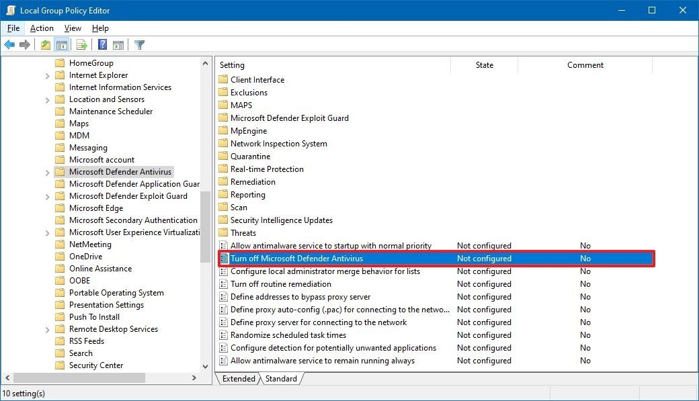

# Disable Microsoft Defender Antivirus

[source](https://www.windowscentral.com/how-permanently-disable-windows-defender-windows-10#disable-microsoft-defender-with-group-policy)

- Open **Start**.
- Search for **gpedit.msc** and click the top result to open the **Local Group Policy Editor**.
- Browse the following path:

    `Computer Configuration > Administrative Templates > Windows Components > Microsoft Defender Antivirus`

- Double\-click the **Turn off Microsoft Defender Antivirus** policy.

    

    *Source: Windows Central*

- Select the **Enabled** option to disable Microsoft Defender Antivirus.

    

    *Source: Windows Central*

- Click the **Apply** button.
- Click the **OK** button.
- Restart your computer.
