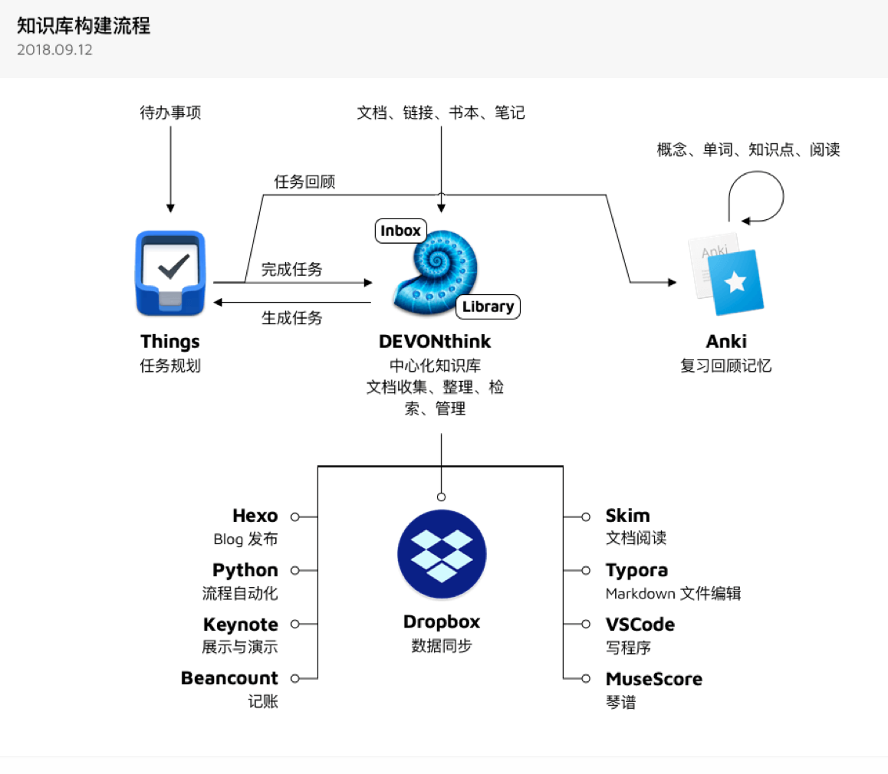

# Some Concept

## 信息获取

## 三种学习的途径

学习途径自己早就有所认识，但应该是 React 官网让我系统意识到的，React 文档提供两种学习途径：

1. Tutorial, Learning in Practice
2. Documentation, Learning by Concepts
3. Share, Learning in Public

前两点是通过经验、通过理论，后一点是公开地学习，比如记录在博客或社交网络，这点带来的好处就如开源的好处一样。在某些技术框架的网站上会看到类似的建议。虽然事实上我们在学校就是一种这样的学习环境。

应用：以后自己开发的项目，也可以在网站上将这三途径介绍给学习者或使用者，作为一种指导或选择。

记录在博客应该是另一种：Learn by writing

[来源](https://github.com/reuixiy/io-oi.me/issues/123)

## 如何建立知识体系

1. 在确定要学习某个主题之前，确定几个问题：这个主题是什么？为什么建立相关知识体系？这个体系有何应用？
2. 专注于和主题相关的事物，不要把注意力放在不相关的事情上。
3. 处理知识的步骤：
   1. 输入（文字最主要，视频次之；）
   2. 整理分类
   3. 输出

The knowledge architecture of others:

### 输入

取消全文保存微信公众号文章步骤（远离印象笔记，它越来越臃肿了），改用 Instapaper

---

近些年，人类似乎进入了一个前所未有的能轻易获得任何知识或信息的时代，但这很可能是个假象——人们很容易觉得自己学会了知识、获得了信息，可是那只是通过各种更容易的方式，让你觉得自己学会了，而真到使用这个知识的时候，会发现之前使用那些容易的方式，只不过是浪费时间而已。

---

学习的重要方法——重复。

学习一个知识，学 1 遍没有学会，继续学习第 2 遍，第 3 遍……第 100 遍，直到学会。

书读百遍，其意自现。

有人是，看一本书，看完一遍：我懂了，但它没让我获得新的认知，所以没用，换另一本，还没有获得认知，继续换……

看新书，总会带来一种「我又变强了」的感觉，但这可能是幻觉

王阳明说：知而不行，是为不知。

读书、学习、看文章，总说自己知道，但不去做，其实就是不知道。说自己知道，可能只是为了好看。

要对自己诚实。

---

[知识管理——少数派](https://sspai.com/tag/%E7%9F%A5%E8%AF%86%E7%AE%A1%E7%90%86)

### 整理分类

知识的去中心化

分类与一元化（如何有效整理信息）

### 输出

