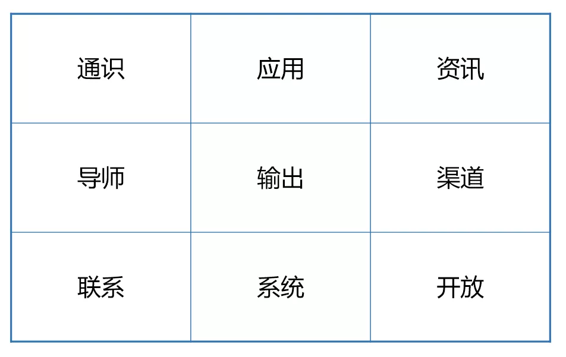
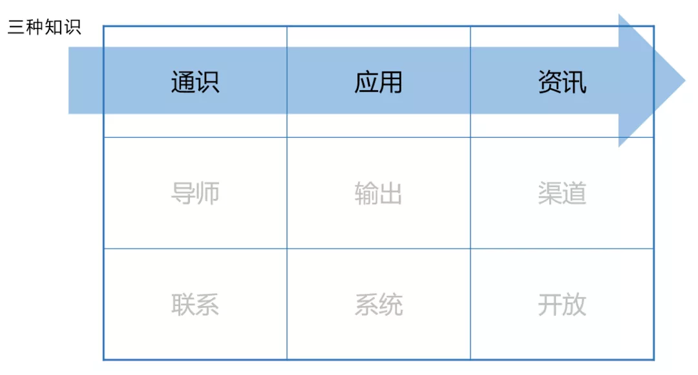
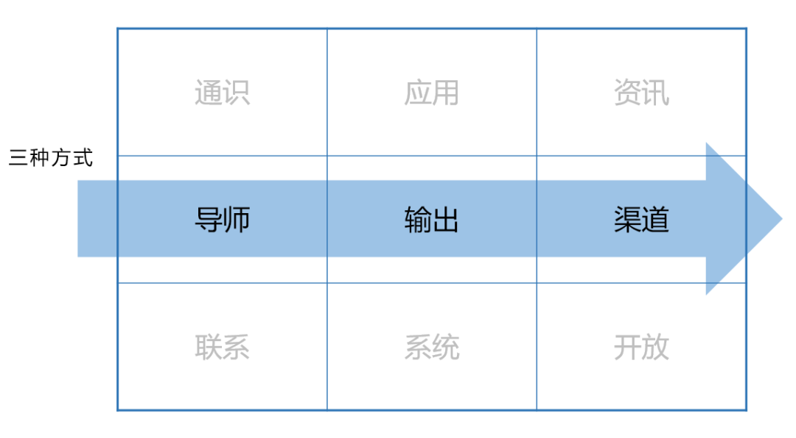
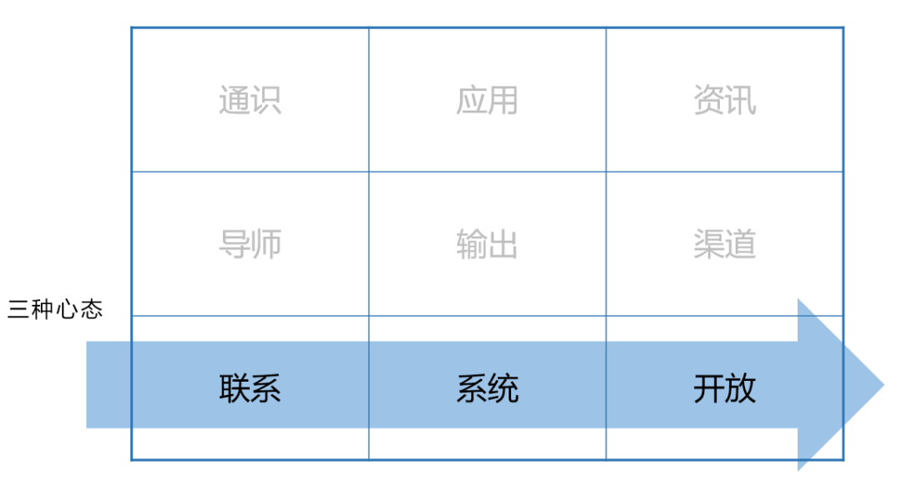
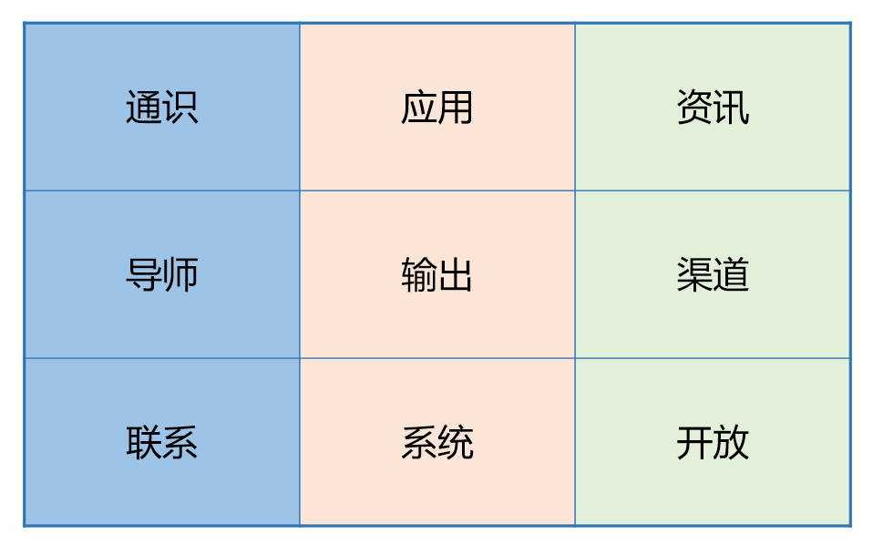

# 建立知识体系，这份指南就够了

来源：<https://mp.weixin.qq.com/s/SZ-Vn587R590RAGyZH-TPA>

最近，许多读者私信我，问到这个问题。

恰好又要推送了，索性分享一些心得。

说实话，这是个很大的问题，要彻底讲透，大概得写一整本书。

所以，我尝试用尽量简洁的篇幅，将这个问题说清楚。希望能给大家一些启发。

这是我总结的「**知识体系矩阵**」。

它有 9 个元素，分别代表了「建立知识体系」过程中，至关重要的 9 个要素。

我们一个个来探讨。

**一、我们学什么：三种知识**

什么是知识体系？

在我的定义中，知识体系是跟碎片知识相对应的概念，指高度有序的知识集合。也就是说，它由两部分组成：**一是大量的知识点，二是有序的结构。**

什么是「有序」？你一定见过这样的人：对某个领域非常精通，无论问他什么问题，他都能从你的话题切入，旁征博引，将大量的原理、机制、知识点……一一娓娓道来，清晰而严谨。

这就是「有序」—— 在他脑海中，所有的知识点都链接在一起。他知道某一个知识点「应该放在哪里」，也知道「它会通向何方」。

如果说碎片知识是一张张街景的速写，那知识体系就是一副完整的地图。

那么，如何实现知识的体系化呢？

我们需要从三个层次切入，分别是通识、应用和资讯。

**1\. 通识**

知识体系的根基，是「大量的知识点」。缺乏这一点，就不成其为体系。没有量的支撑，再精巧、复杂的结构，也是无意义的。

所以，建立知识体系的第一步，就是足够的基础知识 —— 我将其称为「通识」。

这一点至关重要，但许多人却往往在这一步就走错了路。

举个例子：

学哲学，去看心灵鸡汤、人生哲理；

学心理学，去看微表情、性格分析、《梦的解析》；

学社会学，去看《乌合之众》；

学经济学，去看《国富论》《资本论》……

这些，都是不恰当的例子。

以及知乎著名的三大流派：Legal High 法学，三体政治学，货币战争经济学。

为什么呢？很简单。好的通识，必须具备如下三个特点：

**1）范式**

这门学科是研究什么的？用什么方法去研究？目前有哪些普遍认可的原理？—— 这就是范式，亦即一个领域的「话语体系」。

它可以将你的思维方式，调整到这个领域的「公认模式」。

好的通识教材，必须是具备专业范式的。它未必一定要「严肃」，但必须足够「专业」。

譬如某些艺术史，从艳情、宫闱等角度去解读名画，这就不是一个好的范式 —— 它会将你带偏。

**2）广博**

任何领域在发展中，必然都会**不断经历「正\-反\-合」** 的过程。

在入门初期，过多接触某个人、某个流派的观点，乃至于拥有立场，不是一个好的做法。这会束缚你的视野，让你先入为主，再也难以看到整个领域的全景。

所以，更好的做法，是不断地去追求「合」，寻求最新、最广博的成果。

比如，比起读《国富论》《资本论》，读现代经济学教科书就是一个更好的选择。因为后者会站在时代背景的基础上，对前者有更准确、更深入的理解。你会知道哪些是可以吸收的，哪些是可以扬弃的。

**3）客观**

不用多解释了。带着立场和倾向的内容，会导致许多恶果 —— 譬如故意选择有利论据，丑化和批判对立流派，以偏概全，等等。

罗素的《西方哲学史》煌煌巨著，但就是在这一点上广受诟病。包括某些教科书，也多少有不够客观的嫌疑。不展开讲了。

说到这里，你可能会发现一个问题：

通识是入门的必要条件，但尚未入门的人，哪里具备足够的能力去分辨？

这确实是一个悖论。

不用急，我们后面会聊。

接下来，让我们进入第二个层次：应用。

**2\. 应用**

如果说通识是构成知识体系的原料，那么，应用，就是让这些原料发光发热、建立有序结构的方式。

**人类是由意义驱动的族群。** 你会发现，我们所有的知识，本质上，都是为了某种目的而存在的：艺术是为了表达，哲学是为了探索自然，历史是为了认识自己，等等。不存在没有源头、没有意义的「知识」。

在研究和学习上，也是一样的。我们说，最好的学习方法是什么？是**问题驱动。**

一定是你先有了一个问题，对某个事物产生了兴趣，你再去探索它，去完善和丰富自己的知识体系，来试着解决问题。

这才是最有效的学习过程。

所以，从应用层面上来说，同样有 3 个层次：

**1）使命：** 这个领域是为了什么而存在的？

**2）大问题：** 在这个领域中，存在着哪些推动领域发展的「大问题」？前人们是如何思考、回答的？

**3）小问题：** 在具体的学习过程中，我对哪些方面有兴趣？我能提出什么样的问题？我如何组织和思考这些问题？

大问题是就某个领域的发展和演化而言。举个例子：以心理学来说，情绪是什么？意识是什么？大脑的机制是什么？这些，就是心理学家所面临的、需要不断探索和回答的「大问题」。

哲学的入门书，我一直推荐《大问题》和《哲学的门槛》，就是因为它们采用了这样的结构 —— 不是照搬流派和历史，而是告诉你：哲学的发展是要回答什么问题？关于这些问题，历来的哲学家们做出过什么努力？分别有了哪些进展？

这是非常好的入门方式，也是将通识「点石成金」的方法。

小问题，则是针对个人的学习而言。学习这个领域，是为了回答自己哪方面的疑问？解答哪些实际问题？

只有采取问题导向，用这种方式去思考，才能更好地激发和活化你所学到的知识。

举个例子：时间管理有大量的基础知识、工具和方法论，学完这些之后呢？不是照搬，而是看你的背景和需求是什么，需要解决什么问题，然后，再从这些大量的方法论中，抽离出它们的精髓和骨架，重新进行组织结合，演化出一套最适合个人的管理法。

这就是一种「有序的结构」。

通过这种方式，你才能对学到的知识赋予意义和价值，让它们体系化。

一张地图画出来，不是放在那里积灰，而是要用来指引道路的。

知识也是如此。

**3\. 资讯**

前面两点，通识和应用，共同构造了知识体系的绝大部分。

剩下的一部分，就是资讯。

什么是资讯？简单来说，就是对于前两者的更新 —— 亦即一个个小的更新包。

任何一个领域都在发展之中，不断地修正之前的小错误、在某些方向进行探索。它们的形式，可能是论文，杂志，网络文章，书籍，等等。

重点是什么呢？知识体系不是一个静止的东西，而是需要不断迭代和完善的。必须有新的水流进来，再将沉渣冲洗掉，才能不断维持它的生机。

举个简单的例子：上个世纪，心理学的研究成果是「短时记忆可以保持 7 个单位左右」，这就是经典的「神奇数字 7」。它是一个「通识」。

但 21 世纪初的最新研究发现，短时记忆的容量其实只有 4 ，不是 7 —— 这就是一个「更新包」。那么你就会知道：喔，我的知识需要更新了。

现在，你去看近几年出版的心理学科普书，基本全都改过来了 —— 这就是「资讯」经过时间检验，变成了新的「通识」。

如果你不关注这些前沿成果，不去更新自己的知识储备，你就会发现，不知不觉，你的知识已经变得陈旧，已经无法跟上时代，也听不懂别人在说什么了。

所以，求知比知识本身更重要。

**知识不是终点，而是在路上。**

**二、我们从哪里学：三种方式**

**1\. 导师**

我在「通识」中讲过，这其实是一个悖论：要想入门一个领域，你需要好的通识材料；但尚未入门的人，又如何去分辨，什么才是好的通识材料？

这就是答案：你需要一位「导师」。

导师未必是老师，他可以是你的朋友，同事，名人，任何一个人。甚至，也可以不是一个人 —— 一个网站，一个服务，一个在线教育平台，都可以。

他的作用，是为你提供一条有效的**「学习路径」** （Learning Path）。

什么是学习路径？你该从什么地方入门，然后学什么，再然后学什么，接着学什么，等等。最简单的形式，就是书单。

列书单谁都会，但好的书单，非常难得，因为必须考虑许多因素。

最重要的一点，就是**梯度** ：一条好的学习路径，必定是由易到难、由浅入深、由广至专的。

入门时，挑选哪些通识书籍，能最大限度地平衡趣味性和专业性？入门后，该如何挑选不同流派、立场、观点的内容？如何引导一个人，慢慢延伸向更专业、更深入的部分？

这些，都非常考验导师的功力和积累。

另一点是**难度** 。

我们知道，学习有一个「舒适区」理论。待在自己熟悉的地方（舒适区），是学不到东西的，你只是在不断重复；离舒适区太远（危险区），也很难学到东西，因为你完全不懂。

最好的状态，是找到舒适区的边缘，向前一步，我们叫做**「成长区」** —— 既给自己一个挑战，又不至于太难。

这些都是需要考虑的东西。

如果你身边缺乏足够专业的人选，不妨考虑像 Coursera、EDX 等专业的在线教育平台。它们往往有比较成熟的学习路径设计和延伸阅读，这些都有助于建立自己的知识体系。

**2\. 输出**

我一直强调一个观点：

**输出是最好的内化方式。**

经常有人问我：如何更好地记住一个知识点？答案很简单：把它用你的话说出来，教给别人。

同样，如何确保 100%掌握一个知识点？把它写成文章，发出来，让别人去挑刺。

但是，在我们的日常生活中，我们太注重输入，而忽视了输出。

我们每一天刷朋友圈、看新闻、看视频、读书、看公众号、聊天，都是在输入，但输入之后呢？真正能够记住、能够纳入知识体系的，有多少？

可能 10%都不到。

这背后的原因，很大程度上，就是因为缺少输出 —— 我们不断地用「输入」的新鲜感来刺激大脑，却一直害怕思考和付出。

这是没有意义的。

关于这一点，已经讲了太多，可以参考：

[如何把学到的知识真正用起来？](http://mp.weixin.qq.com/s?__biz=MzAxNTY0NjEzNg==&mid=2247484680&idx=1&sn=fc6a836b6de19ec24fadfa450cbf4dab&chksm=9b81a9dfacf620c9dd8787af25ee27f72ebef740b204159c672f22b372cb70defe25f1577f46&scene=21#wechat_redirect)

**3\. 渠道**

渠道，在这里专指信息渠道，亦即我们获取一切「碎片化信息」的来源。

许多人问我：您如何看待碎片化学习？它跟知识体系是不是相悖的？

其实不是。碎片化学习有其作用，但**它的意义在于「更新」和「补充」，而不是「建造」。**

什么意思呢？如果你对一个领域一无所知，那么，碎片化信息有害无益。因为它们往往简单、片面、直观，难以构建有效的逻辑和结构。你所得到的只是一堆砂砾，而不是一座房子。

但如果你已经有了成型的体系，那么，碎片化信息就相当有用了 —— 它可以成为有益的补充。

看到任意一条信息，你会知道，**应该把这条信息「放在哪里」，应该如何去批判、吸收，应该如何去溯源。**

这时，你就是在「将碎片信息体系化」。

但前提是，你必须拥有对这个领域的充分认知和积累。

这方面，我常用的渠道是这些：

1）Google：无论任何领域、任何时刻，Google 都是最好用、最全面的信息来源；

2）论文：国内用知网，国外用 Google 学术+Sci\-hub，可以获取某个领域的前沿信息；

3）数据库：包括 Useit 知识库、各大咨询公司官网、官方统计部门等等，能够帮你获取足够的实证数据。

4）媒体：各类知名博客（如 medium.com）、网络媒体（如 NYT）、杂志（HBR、Fast Company）、聚合平台（Solidot、Techcrunch）等。

5）社群：各类行业微信群，等等。

以上这 6 点（三种知识+三种方式），基本从两个维度，剖析了知识体系。

接下来，我们来看看第三部分。

**三、我们怎么学：三种心态**

**1\. 联系**

我在学习任何一个知识点时，必然会问三个问题：

1）它是什么？

2）它从哪里来？

3）它往哪里去？

不要笑，这是严肃的。

第一个问题，我会去找「同类项」。亦即，从记忆里找到与其相似的概念，弄清楚，它们之间有哪些异同点；这个新的知识点属于什么，不属于什么；是什么，不是什么。

第二个问题，我会去往上溯源，找到这个知识点的来源：谁提出的？怎么来的？原本是为了解决/解释什么的？造成它的原因是什么？等等。

我会不断地问「为什么」，来逼近整个逻辑链条的起源。

第三个问题，我会去往下拓展，去找这个知识点的应用情景。我会去思考，把它放到这个场合下，会怎么样；把它放到那个语境下，又会怎么样。

这就是我的**「包围式学习」。**

你会看到，包围式学习的核心，就是「联系」：尽可能找到并建立起，这个新的知识点，和旧知识点之间的联系。

原因，之前的文章中也讲过许多了，可以参考：[读书最大的误区是什么？](http://mp.weixin.qq.com/s?__biz=MzAxNTY0NjEzNg==&mid=2247484488&idx=1&sn=1e3dfc1298284f9c9e2b47a7a6687013&chksm=9b81a89facf6218913b6adaf9110136870c5ca400049c14041dce5c7fa04d8368841a34a1777&scene=21#wechat_redirect)

孤立地去理解一个知识点，是没有意义的，你记不住它，也无法将它纳入体系中。只有不断去寻求联系，去建立接点和连线，才能将这个知识点，纳入自己的知识网络里面。

这才是学习的本质。

**2\. 系统**

系统和联系，非常像，但又有不同之处。

联系是以新的知识点为核心，对其进行发散关联；而系统的思维方式，则是**「拔高一个层次」** ，从更高的维度，去看待眼前的「整张网络」，关注它本身的结构、所在的位置和接触点。

这说起来有点玄，我举个例子：

打开你手边的一本书，翻到 42 页，你会看到书上密密麻麻的文字，它们构成了某种表达。

现在翻到目录，你会发现，整个 42 页的内容，都浓缩成了目录上的一句话。看到这句话，你就会在脑海里将其「展开」，恢复成原本的内容，你会知道，它大概是讲什么的，提供了什么信息。

现在，将这本书放到书架上，再退后两步，看着你的整个书架。于是，这条目录又跟其他的目录一起，隐藏到整面书架当中，就像一滴水汇入一片海域。

但你会知道，当你要找某个内容时，你可以打开哪本书，找到哪条目录，翻到哪一页，将你要的信息找出来。

这就是一个最最简单的「系统」。

上面所说的，是这个系统中的不同层级。具体内容是一个层级，目录是一个层级，书是一个层级。

再往上延伸，书架、各种知识载体，等等，又是整个更大的系统的一个层级。

每一个层级，就是一个子系统，也是系统中的一个有机组成部分。

当你的视野拔高时，你会发现，你看到的东西会完全不一样，你的思维方式，也会完全不一样。

某个局部战役可能输了，但从整体战略来看，却赢了 —— 就是这个道理。

下围棋，连续三四步无理手，走到后面，却连成了一整片大势，也是一样的道理。

时刻注意「系统」，将自己的思维和视角不断拔高，能有助于你更好地掌握，自己的知识体系。

**3\. 开放**

最后一个至关重要的心态，是开放。

前面讲过，任何一个领域的发展，都必然不断重复「正\-反\-合」的过程 —— 旧的「合」，会成为新的「正」，再进行循环，不断螺旋上升。

这就是一次「**迭代**」。

许多人的弱点就在这里：

笃信自己的「正」，却不敢直视「反」，更不敢推翻自己。

这就无异于断绝了知识的来源，只会一直抱残守缺。

所以，我们说「科学精神」是什么？不是追捧某个理论，认为某个理论「永远正确」，而是求证、探索和质疑。

当一个人坚定自己代表真理时，真理就已经离他而去了。

最后，我们再看这个「知识体系矩阵」。

你会发现，纵向看，它们也是一一对应的：

学什么？通识。怎么学？通过导师。什么心态？联系。

学什么？应用。怎么学？输出。什么心态？系统思维。

学什么？资讯。怎么学？信息渠道。什么心态？开放。

知识体系的本质，就在这里。

当然，从这里开始，到真正掌握和理解一个领域，还有着遥远的道路要走。

一起死磕深度思考和终身学习吧。

知识永远不在某处，知识是在路上。
